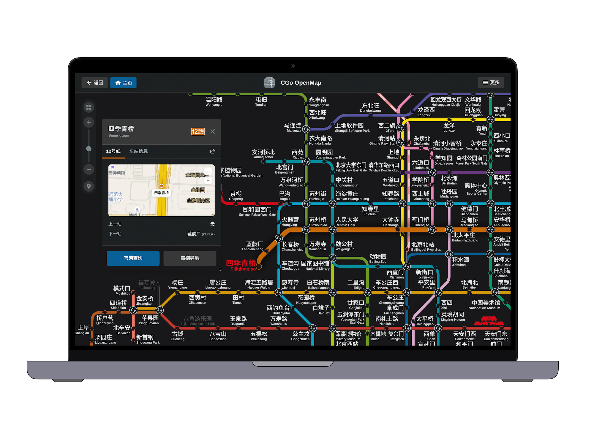

# 🚇 CGo OpenMap - 城市轨道交通线路图开放平台

<p align="center">
  <strong>一款轻量、现代、高度可扩展的开源 Web 城市轨道交通交互线路图引擎</strong>
</p>

<p align="center">
  
</p>

<p align="center">
  <a href="#-项目介绍">项目介绍</a> •
  <a href="#-核心特性">核心特性</a> •
  <a href="#-快速上手与开发指引">快速上手与开发指引</a> •
  <a href="#-项目架构">项目架构</a> •
  <a href="#-如何移植其他城市">移植其他城市</a> •
  <a href="#-致谢与贡献">致谢与贡献</a>
</p>

---

## 📖 项目介绍

<p align="center">
  
</p>

**CGo OpenMap** 是一个专注于城市轨道交通线网可视化与智能交互的**开源基础版地图引擎**。

本项目旨在为广大交通迷、城市规划爱好者与前端开发者提供一套**开箱即用、轻量高效、零框架依赖**的交互式线路图解决方案。目前默认以“北京轨道交通线网”作为完整参考范例，并已构建完善的**多城市解耦架构**与标准化数据规范，方便网友和开发者快速构建并部署任意城市（如上海、广州、深圳、成都、武汉、南京、杭州等）的地铁线路图版本。

---

## ✨ 核心特性

- 🚀 **极速轻量与零框架依赖**
  - 基于纯原生 Web 技术栈（HTML5 + SVG + Vanilla JS + Web Components + CSS3）开发。
  - 无需庞大的前端打包框架，首屏秒级直出，体积轻巧且运行流畅。
- 🗺️ **流畅自如的地图交互**
  - 支持多级平滑缩放（滚轮/触控板/手势/按钮控制）、自由拖拽漫游与智能边界回弹。
  - 内置深色模式（Dark Mode）与浅色模式，支持随系统自动切换或手动锁定。
- 🔍 **多维智能车站检索**
  - 支持中文站名、英文名称、拼音首字母、多音字及历史更名别名的即时模糊匹配。
  - 点击检索结果即刻平滑飞跃并高亮居中车站。
- 🚉 **精细化站点与线路模型**
  - **车站图卡**：支持展示换乘线路、车站中英文、运营单位、出入口与接驳信息。
  - **站台结构图**：支持查看精细化站台换乘与楼梯分布结构示意。
  - **首末班车时刻**：集成时刻表查询接口，支持官方/外部时刻快速对接。
  - **出站虚拟换乘**：完整支持同站名不同站厅、出站限时虚拟换乘等复杂逻辑。
- 📍 **LBS 定位与导航辅助**
  - 基于浏览器地理位置 API 快速计算周边最近地铁站与直线距离。
  - 一键调起高德地图导航或主要火车站 12306 购票链接。
- 🎨 **矢量美学与文化徽标**
  - 纯矢量 SVG 线路平滑渲染，自适应高分屏。
  - 支持重点历史文化车站（故宫、天坛、颐和园等）专属特色徽标展示。
- 🏙️ **模块化多城市架构**
  - 核心引擎逻辑（`core/`）与城市业务数据（`city/`）彻底解耦。
  - 采用标准化配置清单，制作新城市只需填充对应的数据文件，无需重写底层渲染逻辑。
- 📱 **PWA 渐进式应用支持**
  - 完善的 Service Worker 离线缓存与 Web App Manifest 配置。
  - 支持在 Windows / macOS / iOS / Android 上作为独立 App “安装”至桌面全屏运行。

---

## 🚀 快速上手与开发指引

### 📚 开发文档导航

无论你是零基础新手、资深前端开发者，还是正在使用 AI Agent 协作，我们都为你准备了针对性的文档：

| 读者对象 | 推荐阅读文档 | 说明 |
|---|---|---|
| 👶 **零基础新手小白** | 🚀 **[新手小白实战手册 (DEEPSEEK_QUICKSTART.md)](./DEEPSEEK_QUICKSTART.md)** | 手把手教你安装 VS Code、配置免费的 DeepSeek AI 插件，用大白话指挥 AI 帮你画地铁图 |
| 🤖 **AI Coding Agent** | 🤖 **[AI Agent 快速上手指南 (AGENTS.md)](./AGENTS.md)** | 面向各类 AI Agent（DeepSeek / Antigravity / Cursor / Claude 等）的项目架构、解耦规范与数据标准 |
| 🛠️ **城市移植开发者** | 🛠️ **[城市移植实操手册 (transition.md)](./transition.md)** | 从零配置上海、广州、深圳等新城市车站、线路、图例与时刻表的全流程步骤 |

---

### 本地运行

由于项目使用了原生 ES Modules 和 Service Worker，建议使用静态本地服务器运行：

1. **克隆或下载代码库**
   ```bash
   git clone https://github.com/NokiaimuL/CGo-OpenMap.git
   cd CGo-OpenMap
   ```

2. **使用任意静态服务器运行**
   - **VS Code（最推荐）**：安装 `Live Server` 插件，在 VS Code 右下角点击 **Go Live**（或右键 `index.html` 选择 **Open with Live Server**）。
   - **Node.js (npx)**：
     ```bash
     npx serve .
     ```
   - **Python**：
     ```bash
     # Python 3
     python3 -m http.server 8080
     ```

3. 打开浏览器访问 `http://localhost:8080`（或 `http://127.0.0.1:5500`）即可开始体验。

---

## 📂 项目架构

```text
openmap/
├── index.html                  # 主入口页面
├── LICENSE                     # 双轨开源许可协议 (GNU AGPLv3 + ODbL 1.0)
├── CONTRIBUTING.md              # 社区贡献与城市主理人指南
├── AGENTS.md                   # AI Agent 快速上手指南 (架构规范/解耦铁律)
├── DEEPSEEK_QUICKSTART.md      # 面向零基础小白的 DeepSeek 环境与启动手册
├── transition.md               # 城市移植新手实操手册
├── README.md                   # 项目开源说明主文档
├── readme.html                 # 网页版内置说明弹窗页面
├── privacy.html                # 隐私政策说明
├── manifest.json               # PWA 应用配置文件
├── sw.js                       # 离线缓存 Service Worker
├── core/                       # 核心引擎层 (多城市通用)
│   ├── cgo-ui.js               # CGoUI Web Components 基础组件库
│   ├── script.js               # 地图主渲染引擎、坐标转换、手势与交互逻辑
│   ├── settings.js             # 偏好设置面板逻辑
│   ├── help.js                 # 帮助与关于弹窗逻辑
│   ├── notice.js               # 动态通知与公告系统
│   └── tool-theme.js           # 主题切换与颜色调度
├── city/                       # 城市数据与业务配置层 (按城市解耦)
│   ├── data.js                 # 城市注册总线与元数据中心
│   └── beijing/                # 示例城市：北京
│       ├── beijing.js          # 北京特有业务关系与接口
│       ├── data_stations.js    # 车站坐标、站名、对齐与属性
│       ├── data_lines.js       # 线路序列、颜色、站距与运营信息
│       ├── data_legend.js      # 图例结构与分组展示数据
│       ├── data_timetable.js   # 车站首末班车时刻数据
│       ├── data_notopen.js     # 在建及暂未开通线路数据
│       ├── data_scattered.js   # 孤立/特殊连接线路段
│       ├── data_virtual_transfers.js # 虚拟换乘与出站连通定义
│       ├── staname.csv         # 拼音检索与更名索引库
│       └── stacard/            # 车站详情卡片与结构图组件
├── css/                        # 样式表
│   ├── style.css               # 地图核心样式
│   ├── cgo_ui.css              # CGoUI 基础样式
│   ├── cgo_clr.css             # 线路标志色与主题配色变量
│   ├── cgo_element.css         # UI 基础元素样式
│   └── cgo_components.css      # 车站卡片与检索面板组件样式
└── assets/                     # 资源文件
    ├── icons/                  # 站点、应用与系统图标
    ├── svg/                    # 线路徽标 SVG
    └── images/                 # 预览与截图
```

---

## 🛠️ 如何移植其他城市？

制作你所在城市的地铁线路图非常简单，你只需：

1. **复制模板**：在 `city/` 目录下新建城市文件夹（例如 `city/shanghai/`）。
2. **注册城市**：在 `city/data.js` 中注册你的城市 ID、画布中心点与尺寸等基础配置。
3. **编排数据**：
   - 填充 `data_stations.js`（车站坐标、名称、换乘属性）。
   - 填充 `data_lines.js`（线路走向、站点串联顺序、线路标志色）。
   - 准备对应的线路 SVG 图标放入 `assets/svg/`。
4. **刷新预览**：在浏览器中即刻查看渲染出的新城市地铁线路图！

👉 **详细的保姆级教程请阅读：[城市移植手册 (transition.md)](./transition.md)**

---

## 🌟 城市主理人计划与鸣谢 (City Maintainers)

本项目倡导**开放共建、共同主理**。凡是完整移植或主要维护某座城市数据的开发者，均自动成为该城市的官方主理人，并在 UI、文档及数据注册表中永久保留署名与主页链接：

- **北京线网**：[NaL](https://github.com/NokiaimuL/)（城市主理人） · SierraQin（运营数据支持） · Freedom Space（市郊铁路校对）
- **上海线网**：*主理人虚位以待，欢迎认领*
- **平台架构**：[NaL](https://github.com/NokiaimuL/) & [Ryan](https://github.com/ryan-si)（网页底层技术架构支持）
- **地理数据**：[高德地图开放平台](https://lbs.amap.com/)（地理编码与经纬度支持）

> 📢 想要认领你所在城市的线路图并成为官方城市主理人？请阅读 **[社区贡献指南 (CONTRIBUTING.md)](./CONTRIBUTING.md)**。

---

## 🛡️ 版本升级与兼容性保障承诺

CGo OpenMap 引擎底层正处于快速迭代演进中（包括未来支持的换乘路径算法、时刻表联动、3D/实际走向模式联动与图形渲染性能大重构）：

- **✅ 合入官方主库的城市**：官方核心团队承诺提供**终身向后兼容支持、自动化数据格式迁移工具与全量功能测试**，确保你的城市始终享受最新引擎特性与持续 Bug 修复；
- **❌ 私自保留的独立分支**：由于脱离官方生态，未来底层引擎演进时私有格式将迅速失配，需自行承担极高昂的代码重构与维护成本。

欢迎所有移植新城市的开发者积极向官方仓库提交 Pull Request，共同壮大开源线路图生态！

---

## 📄 双轨开源许可协议 (Dual-License)

本项目采用代码引擎与城市业务数据分离的**双轨开源协议**架构（详见 [LICENSE](./LICENSE)）：

1. **核心引擎与交互代码 (`core/`, `css/`, `index.html` 等)**：基于 **[GNU AGPLv3](./LICENSE)** 开源。任何在网络服务器上运行并向公众提供交互式在线地图服务的修改版本，均必须向访问用户公开完整源代码。
2. **城市地图与业务数据层 (`city/` 目录)**：基于 **[ODbL 1.0 (Open Database License)](https://opendatacommons.org/licenses/odbl/)** 与 **[CC BY-SA 4.0](https://creativecommons.org/licenses/by-sa/4.0/)** 相同方式共享协议开源。任何基于本项目数据衍生或扩充的新城市线网数据库一旦公开，必须保持同等协议开源共享；主仓库依法享有将公开衍生数据合并收编的权利。
3. **知识产权说明**：各城市轨道交通系统的官方标志、线路名称、官方标志色及运营数据版权归各属地轨道交通运营公司所有。

